# ✌️SKN04-2nd-1Team

# Predicting Customer Churn
<p align="center"></p>

<hr>

## Team Name : 👍Team Jeonghoon👍
 
### 🤦‍♂️ Team Members

<p align="center">
    <table>
        <tr>
            <td align="center">
	 <br> 👼 박병헌 Park Byung Hun (Team Leader,ML,Readme)
        </td>
        <td align="center">
	 <br> 👼 김현재 KIM Hyeon Jae (ML)
        </td>
        <td align="center">
	 <br> 👼 변가원  Byeon Ga Won (DL,Readme)
        </td>
        <td align="center">
	 <br> 김정훈 Kim Jeong Hun (DL)
        </td>
        </tr>
    </table>
</p>

<hr>

### 👨‍🏫 Project Overview
  Customer churn is a significant issue for businesses.  <br>
 When customers move to competitors, it directly impacts profitability. To address this, our team built a predictive model based on customer data to identify potential churners early and take proactive retention actions.
<hr>

### 👩‍🏫  Project Goal
Our goal is to detect customers likely to churn using a predictive model, allowing for targeted retention strategies.

<hr>

### 🔨 Tech Stack
<div>
 


</div>

<hr>

### Prerequisites

```cmd
pip install pandas 
pip install numpy 
pip install scikit-learn
pip install torch
pip install pytorch-lightning
pip install nni
```

<hr>

### Usage

```cmd
python train.py
```

<hr> 

### Data

We used the following customer data: <b>Churn</b> (whether the customer has churned), <b>TotalRecurringCharge</b> (monthly recurring charge), <b>MonthsInService</b> (duration of service usage), <b>CurrentEquipmentDays</b> (number of days using the current device), <b>CreditRating</b> (customer credit rating), <b>RetentionCalls</b> (number of retention calls made), <b>RespondsToMailOffers</b> (whether the customer responds to mail offers), <b>BuysViaMailOrder</b> (whether the customer purchases through mail order), and <b>HandsetWebCapable</b> (whether the handset is web-capable).

<h3>1. Customer Loyalty Label</h3> Based on 'MonthsInService' and 'RetentionCalls', this label reflects how long the customer has remained with the service and the result of retention efforts. <h3>2. Equipment Usage Duration</h3> Reflects how long the customer has been using their current device, based on 'CurrentEquipmentDays'. <h3>3. Charge Burden</h3> Classifies whether the customer's recurring charge is high or low using 'TotalRecurringCharge'. <h3>4. Credit Rating Category</h3> Divides customers into two groups based on their 'CreditRating'. <h3>5. Purchase and Mail Response Behavior</h3> Combines 'BuysViaMailOrder' and 'RespondsToMailOffers' to assess the customer’s marketing engagement. <h3>6. Handset Web Capability</h3> Determines whether the customer’s handset is web-capable using 'HandsetWebCapable'.

<br><br>

These preprocessing steps were aimed at producing meaningful results.


<hr>

# EDA

## Data Analysis and ML

### Base Model
We aimed to identify meaningful features for predicting churn using ML models. Using seaborn's kdeplot and countplot, we analyzed the distribution of features by churn status.

The following features were found to be highly relevant:

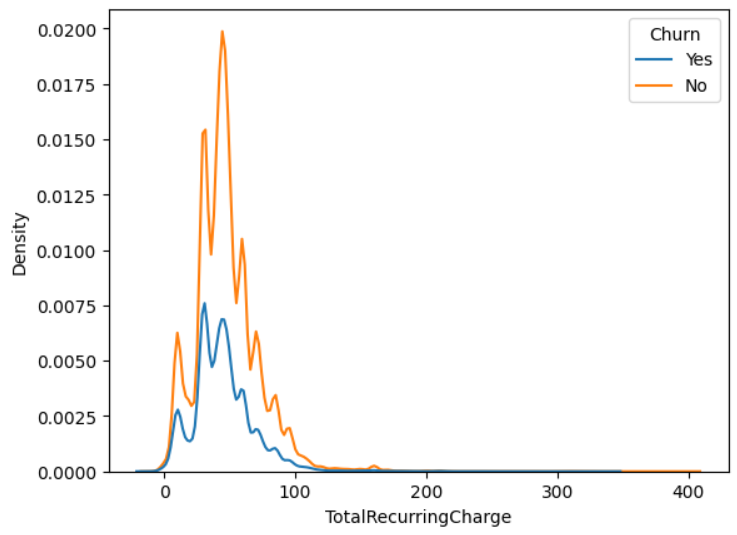

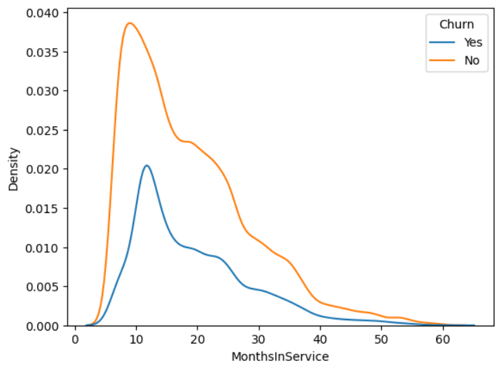

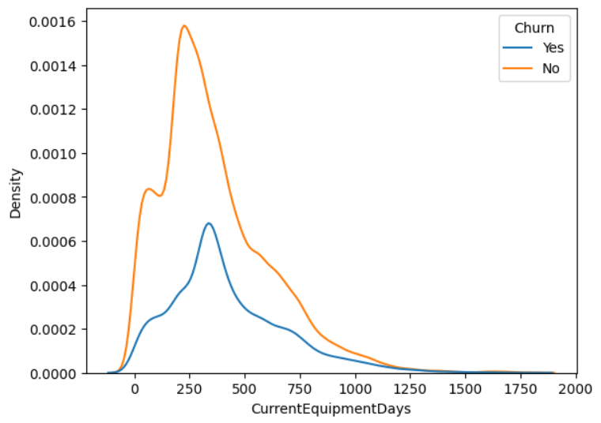


The following five features showed some distributional differences:

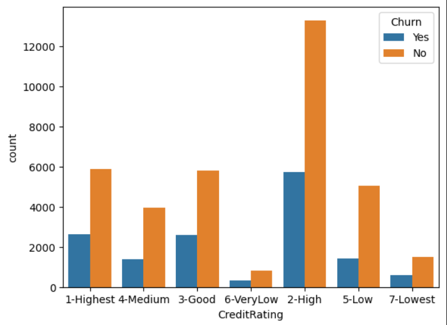

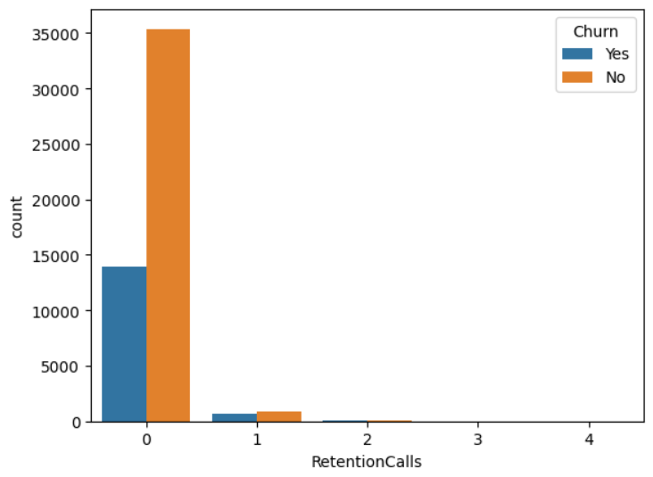

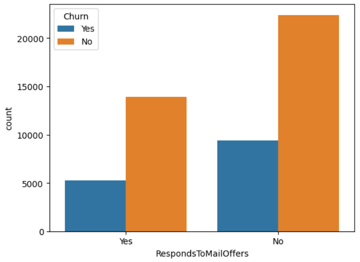

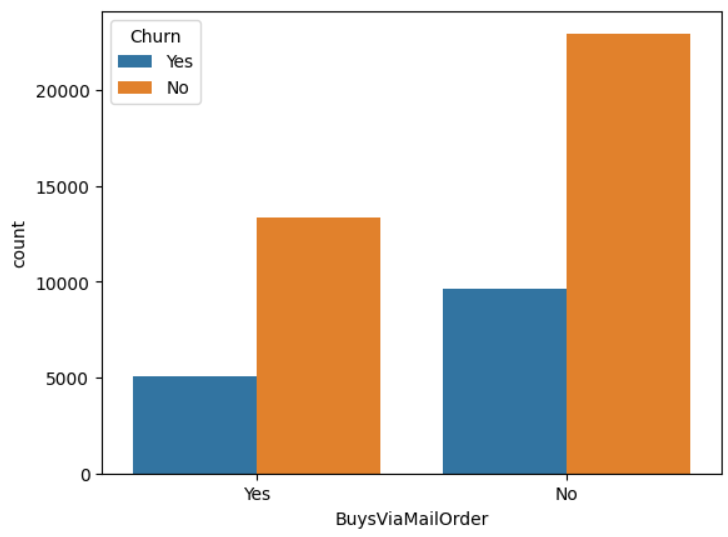

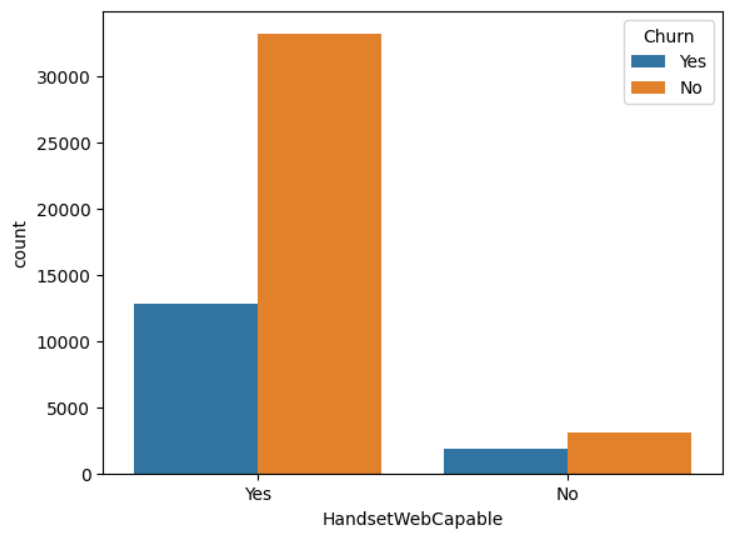

We trained a LightGBM model using these features. The results are shown below:

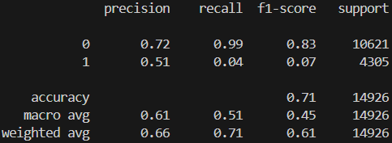

The recall for class 1 (churned customers) was very low at 0.04, indicating the model failed to correctly predict most churn cases.


### New feature model


To address the lack of effective features, we developed a strategy to create new features by combining existing ones.

```Python

# 1. Customer Loyalty Label
# Reflects how long the customer has stayed with the service and the outcome of retention efforts, based on 'MonthsInService' and 'RetentionCalls'
data['CustomerLoyalty'] = np.where(
    (data['MonthsInService'] > data['MonthsInService'].mean()) &
    (data['RetentionCalls'] > 0), 
    'High Loyalty', 'Low Loyalty'
)

# 2. Equipment Usage Duration Label
# Indicates how long the customer has been using the service based on 'CurrentEquipmentDays'
data['EquipmentUsageDuration'] = np.where(
    data['CurrentEquipmentDays'] > data['CurrentEquipmentDays'].mean(), 
    'Long-Term Equipment User', 'Short-Term Equipment User'
)

# 3. Charge Burden Label
# Classifies the level of financial burden based on 'TotalRecurringCharge'
data['ChargeBurden'] = np.where(
    data['TotalRecurringCharge'] > data['TotalRecurringCharge'].mean(), 
    'High Charge', 'Low Charge'
)

# 4. Credit Rating Category
# Categorizes credit rating into two groups based on 'CreditRating'
data['CreditCategory'] = np.where(
    data['CreditRating'] > data['CreditRating'].median(), 
    'High Credit', 'Low Credit'
)

# 5. Purchase and Mail Response Behavior
# Assesses customer engagement with marketing by combining 'BuysViaMailOrder' and 'RespondsToMailOffers'
data['MarketingEngagement'] = np.where(
    (data['BuysViaMailOrder'] == 'Yes') & (data['RespondsToMailOffers'] == 'Yes'), 
    'Fully Engaged',
    np.where(
        (data['BuysViaMailOrder'] == 'Yes') | (data['RespondsToMailOffers'] == 'Yes'), 
        'Partially Engaged', 'Not Engaged'
    )
)

# 6. Handset Web Capability
# Classifies whether the handset is capable of web usage based on 'HandsetWebCapable'
data['HandsetWebCapability'] = np.where(
    data['HandsetWebCapable'] == 'Yes', 
    'WebCapable', 'NonWebCapable'
)

```
We created six new features as described above and performed similar analysis:

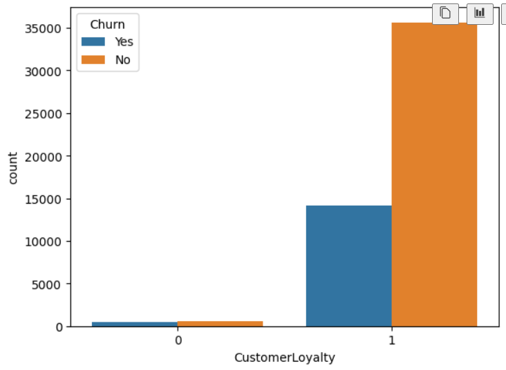

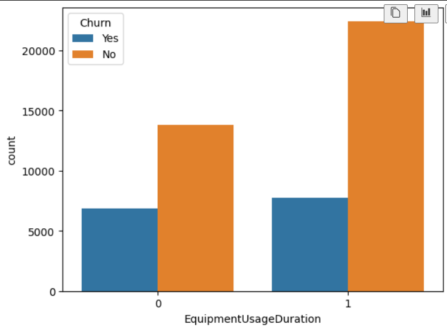

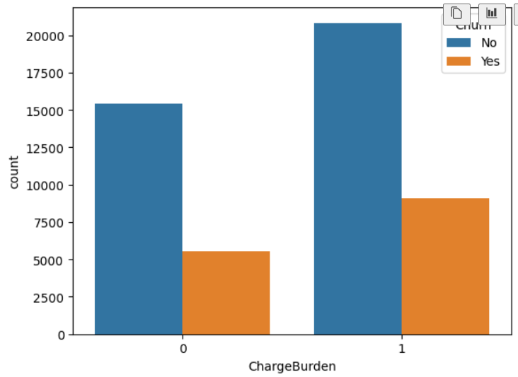

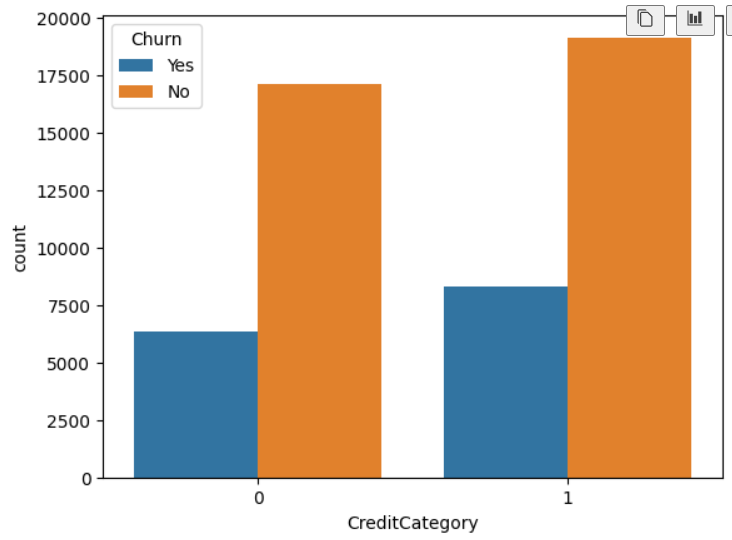

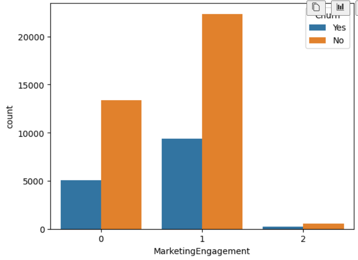

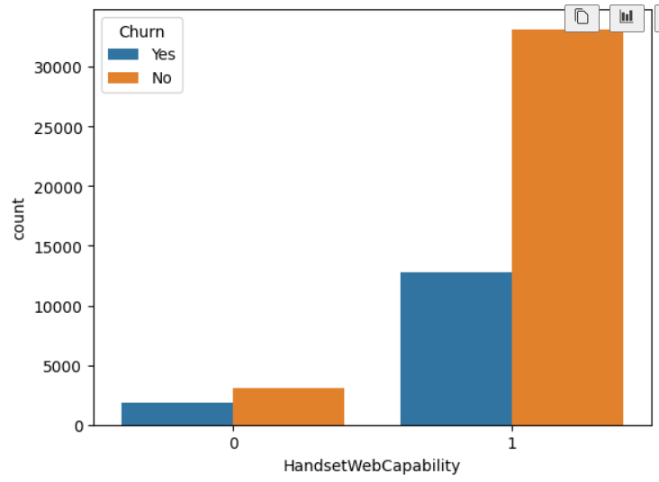

We trained a new LightGBM model with the engineered features:

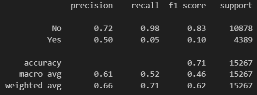

### New feature model_2

We refined our approach by selecting only four features that showed a clear distributional difference:
'TotlaRecurringCharge', 'MonthsInService', 'CurrentEquipmentDays', and 'CustomerLoyalty'.

We visualized the distributions again:


After training the LightGBM model again:

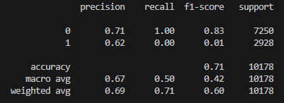

The performance did not improve.


## Deep Learning (DL)

We trained models using the entire dataset. Results are as follows:<br><br>
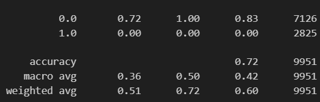
<br>Training with selected features gave similar results:<br><br>
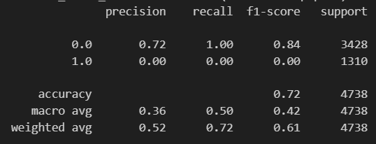
<br>
Accuracy remained at 0.72, indicating no significant improvement: <br><br>
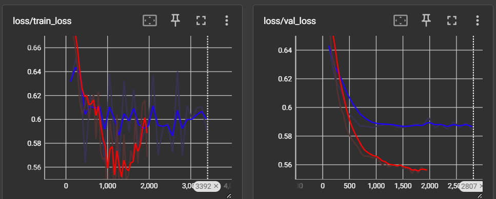<br>
(Blue: before preprocessing / Red: after preprocessing)
<br>
While accuracy didn't improve, there was a meaningful difference in loss, as shown above.
<br>
It was clear that due to the class imbalance (majority of samples are non-churn), the model failed to predict churned customers accurately.
<br>
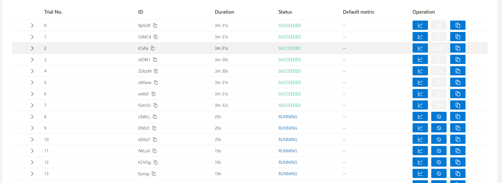<br>
Although NNI tuning was successful, metrics were not automatically returned and had to be manually extracted.
<hr>

## Final Results

Accuracy remained at 0.71, which corresponds to the proportion of non-churn cases.

There were 35,507 "Yes" cases and 14,245 "No" cases.
35507 / (35507 + 14245) = 0.71.

This shows that the model simply learned to predict the majority class and was unable to effectively distinguish churned customers.

Additionally, the dataset suffers from a significant class imbalance problem, with a strong skew toward the "Yes" class.

**Summary of Challenges**

1. Feature distributions by Churn class are not clearly separable.

2. Severe class imbalance toward Churn == "Yes".

To better understand issue 1, we visualized the data using T-SNE:<br>
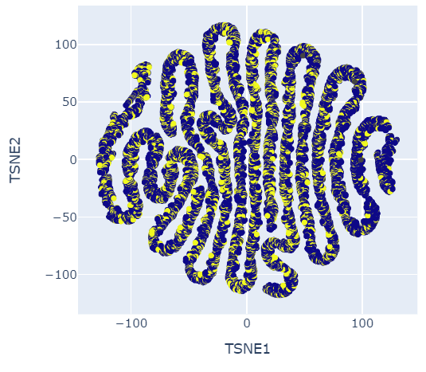
<br>
Yellow: Yes, Blue: No

We can see that the data points are not well separated.

To address issue 2, we considered over-sampling methods. One example is SMOTE (Synthetic Minority Over-sampling Technique), which generates synthetic samples using the nearest neighbors method.

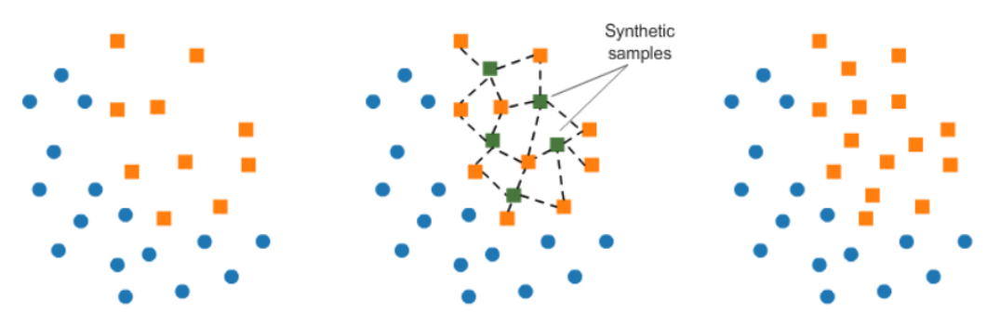
<br>
Image Source:https://www.kaggle.com/code/rafjaa/resampling-strategies-for-imbalanced-datasets

While SMOTE can improve recall, it may reduce precision, so it should be used carefully.

Due to the two issues above, both ML and DL models failed to improve accuracy beyond 0.71, and recall for churned customers remained very low.

<hr>

## One-Line Reflections
<br>

<h3>👼박병헌 Park Byung Hun</h3>
<hr> Through this project, I realized the importance of data analysis for ML model training and gained hands-on experience that strengthened my analytical skills.
<br><br>
<h3>👼김현재 KIM Hyeon Jae</h3>
<hr> 
It was a great opportunity to apply what I learned in ML and deepen my understanding of data analysis.<br><br>
<h3>👼변가원 Byeon Ga Won</h3>
<hr> 
 By applying what we learned in class, I gained a much deeper understanding of ML and DL through hands-on experience.<br><br>
<h3>👼김정훈 Kim Jeong Hun</h3>
<hr> 
Dealing with data imbalance was not easy. I tried various methods like changing models and increasing layers to get the desired result, but it was still difficult. It felt like a reflection of real life.<br><br>
